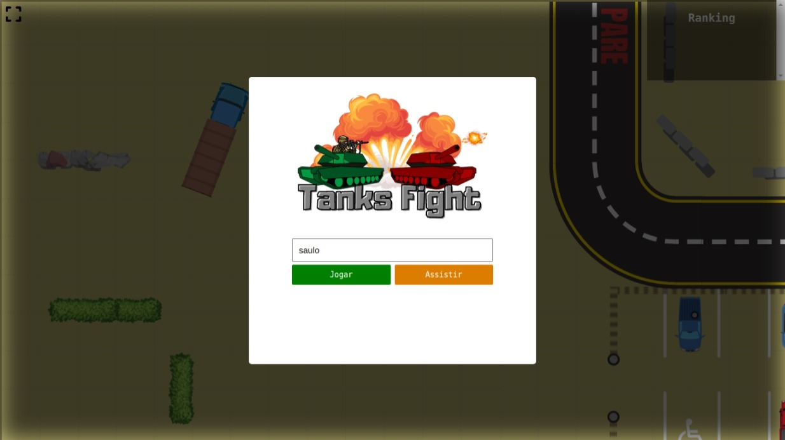
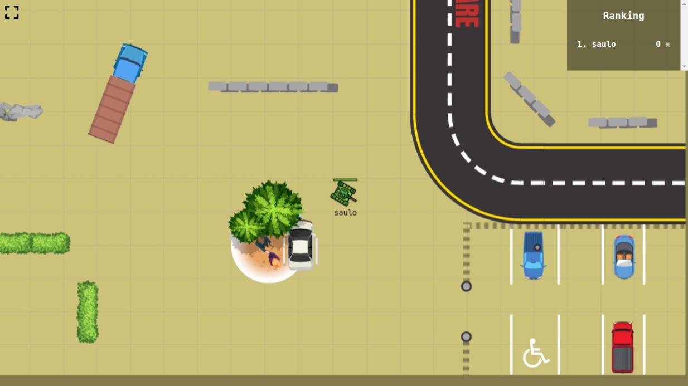

<p align="center">
    
</p>

------------------------------------
## Índice

* [Sobre](#sobre)
* [Funcionalidades](#funcionalidades)
* [Layout](#layout)
* [Como Executar](#como-executar)
* [Tecnologias](#tecnologias)
* [Autor](#autor)
* [Licença](#licenca)
* <a href="https://multiplayer-game-saulo.herokuapp.com/" target="_blank"> 🏪 Multiplayer game com Nodejs ---- Concluído ✅ ----</a>

------------------------------------

## 💻 Sobre <a id="sobre"></a>
Jogo de batalha de tanks multiplayer.
<br>

------------------------------------

## ⚙️ Funcionalidades <a id="funcionalidades"></a>
1. ✅ Responsividade
2. ✅ Dinâmico
3. ✅ Multiplayer
4. ✅ Ranking

------------------------------------

## 🎨 Layout <a id="layout"></a>

<a href="https://multiplayer-game-saulo.herokuapp.com/"></a>

<p>*O Layout completo do game está disponível <a href="https://multiplayer-game-saulo.herokuapp.com/">aqui</a>.</p>




------------------------------------

## 🧩 Como Executar <a id="como-executar"></a>

Para executar o projeto na sua máquina, basta seguir a sequencia de passos:

```
# Clone o repositório
$ yarn install && node server.js
```

------------------------------------

## 🤖 Tecnologias <a id="tecnologias"></a>

Neste game, foram utilizadas as seguintes tecnologias: 


* HTML5  
* CSS3 
* Javascript 
* Nodejs 

------------------------------------

## 👨 Autor <a id="autor"></a>

<p align="center">➡️ Criado e desenvolvido por <strong>eu</strong> mesmo 🧑‍💻.</p>

------------------------------------

## 📜 Licença <a id="licenca"></a>

<p align="center">Todos os direitos reservados ©Copyright - Saulo Felipe</p>
